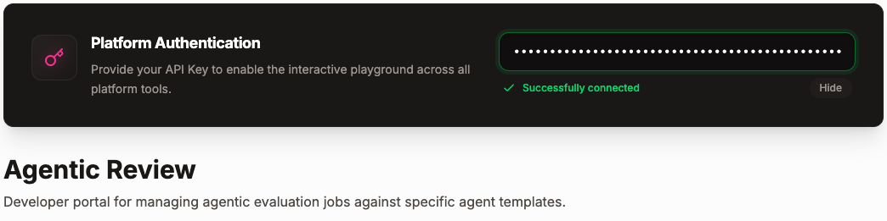
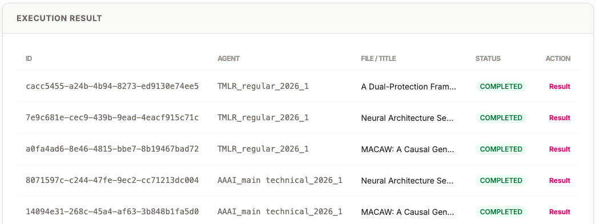

<h1>
  
  Partner Platform Examples
</h1>

Examples of calling the platform APIs of CSPaper, part of Scholar7.

Platform homepage:
https://cspaper.org/platform

This repository is intended to provide practical, runnable examples for common platform services provided by CSPaper. The first example included here is Agentic Review, with additional examples for paper ranking, correctness check, reference check, and code check planned next.

## Getting Started

### 1. Create a Python virtual environment

From the repository root:

```bash
python3 -m venv env
source env/bin/activate
```

### 2. Install dependencies

```bash
python -m pip install -r requirements.txt
```

### 3. Configure your environment

Create a local `.env` file from the provided example:

```bash
cp env-example .env
```

Then edit `.env` and set your values:

```dotenv
API_KEY=your-api-key-here
API_URL=https://cspaper.org
```

`API_KEY` is used for authentication to the CSPaper platform APIs.

## Agentic Review

The easiest way to test agentic review API is visiting https://cspaper.org/platform/review via your browser without the need of sign-in. You need to paste-in your API Key on top of the page.



To submit agentic review jobs in batch, follow the steps below:

### Prepare Input Papers

By default, the scripts expect your paper PDFs in:

```text
./papers
```

Each PDF in that folder is treated as one paper submission. Example layout:

```text
platform-examples/
  papers/
    paper-1.pdf
    paper-2.pdf
    paper-3.pdf
```

You can use a different input folder with `--paper-dir`, but if you do, use the same `--paper-dir` value for both submission and polling.

### Submit Review Jobs in Batch

Run from the repository root:

```bash
python agentic-review/submit-batch.py --agent-id="AAAI_main technical_2026_1"
```

Note: you need to select the correct `agent-id` for your target venue or review template.

The current list of available agent IDs is provided here:
https://cspaper.org/platform/review

`agent-id` examples:

```text
AAAI_main technical_2026_1
ACL_main_2026_1
AISTATS_main_2026_1
CoG_technical and vision_2025_1
CVPR_main_2026_1
EMNLP_main_2025_1
ICLR_main_2026_1
ICML_main_2026_1
ICML_position_2025_1
TMLR_regular_2026_1
... ...
```

What the script does:

1. Reads all `*.pdf` files from the paper directory.
2. Submits each paper to the platform review API.
3. Writes submission records to:

```text
./output/submissions.json
```

Each record includes:

- `filename`
- `job_id`
- `agent_id`
- `submitted_at`

> **Note**: Before sending new requests, the submission script checks existing records in `submissions.json`.
> A paper is skipped only when the same combination of `filename` and `agent_id` has already been submitted.
> This means the same PDF with the same `agent_id` will be skipped, while the same PDF with a different `agent_id` can still be submitted.
> Skip decisions are printed clearly in the terminal.

### Poll Review Results

Polling is needed because review jobs are asynchronous. The main reasons are

1. Each review can take anywhere from about 1 minute to 15 minutes, depending on the complexity of the selected review agent and the paper being reviewed.
2. The number of review jobs that can run concurrently is limited, and that shared capacity is also used by end-user review requests submitted through UI.

To poll the review results, simply run:

```bash
python agentic-review/poll-result-batch.py
```

If you used a custom paper directory during submission, use the same one here:

```bash
python agentic-review/poll-result-batch.py --paper-dir ./papers
```

Concretely, the polling script does the following:

1. Reads `./output/submissions.json`.
2. Checks the review status for each stored job.
3. Waits and retries until each job is completed, failed, or timeout is reached.
4. Saves each completed result as a Markdown file in `./output` named after pattern `<paper_stem>__<agent_id>.md`, such as `./output/tmlr-5831__TMLR_regular_2026_1.md`

### Example Run

Example submission:

```text
python agentic-review/submit-batch.py --agent-id TMLR_regular_2026_1
Found 3 PDF(s): 3 to submit, 0 already recorded
  submitted tmlr-5831.pdf -> job a0fa4ad6-8e46-4815-bbe7-8b19467bad72
  submitted tmlr-6121.pdf -> job 7e9c681e-cec9-439b-9ead-4eacf915c71c
  submitted tmlr-6722.pdf -> job cacc5455-a24b-4b94-8273-ed9130e74ee5

3 submitted: 3 ok, 0 failed
Submissions saved to output/submissions.json
```

Example polling:

```text
python agentic-review/poll-result-batch.py

Polling 3 job(s) — interval 30s, timeout 1800s

  3 job(s) still pending — waiting 30s...
  3 job(s) still pending — waiting 30s...
  3 job(s) still pending — waiting 30s...
  3 job(s) still pending — waiting 30s...
  3 job(s) still pending — waiting 30s...
  3 job(s) still pending — waiting 30s...
  3 job(s) still pending — waiting 30s...
  3 job(s) still pending — waiting 30s...
  3 job(s) still pending — waiting 30s...
  3 job(s) still pending — waiting 30s...
  [COMPLETED] tmlr-5831.pdf -> output/tmlr-5831__TMLR_regular_2026_1.md
  2 job(s) still pending — waiting 30s...
  [COMPLETED] tmlr-6121.pdf -> output/tmlr-6121__TMLR_regular_2026_1.md
  [COMPLETED] tmlr-6722.pdf -> output/tmlr-6722__TMLR_regular_2026_1.md

All jobs collected.
```

### Review Job Visibility in the Platform UI

You can also inspect submitted jobs directly in the platform UI:
https://cspaper.org/platform/review

After entering your API key on that page, you can check available review templates and monitor submitted review jobs there as well.



## Paper Ranking

Coming soon.

## Correctness Check

Coming soon.

## Reference Check

Coming soon.

## Code Check

Coming soon.
